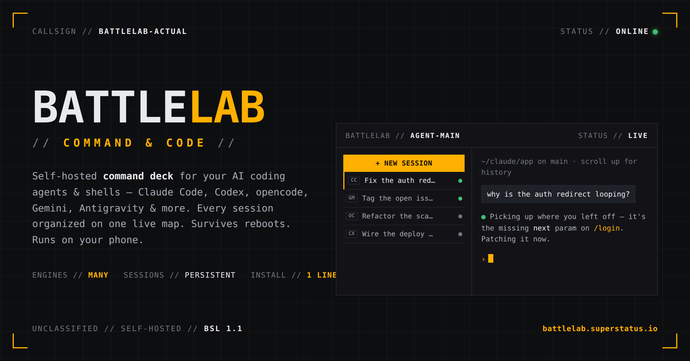

<h1 align="center">⚔️ BattleLab</h1>

<p align="center"><strong>Command &amp; Code.</strong> A mobile-first, self-hosted command deck for your AI-coding agents.</p>

<p align="center"><a href="https://battlelab.superstatus.io">battlelab.superstatus.io</a></p>

<p align="center">
  
</p>

**One web app that organizes every session from Claude Code, Codex, opencode, Gemini, Antigravity — plus plain shells**,
with a real terminal that survives reboots and deploys, and an end-to-end-encrypted blind relay so you can drive your
whole fleet from a laptop or your phone.

  

### Why

- **Every agent, one place.** A live sidebar of every session across every engine, grouped by
  project, with per-row badges + filtering.
- **Persistent terminals.** Each session runs under its own `dtach` PTY — close the tab, reboot, or
  upgrade the app and reattach to the exact conversation, with clean console-style scroll-up.
- **Pulse + Ask.** An AI-curated "state of your work" across every agent, plus a plain-language
  finder for past sessions ("which session fixed the ws reconnect bug?") — one tap back in. Reuses
  your own OpenAI-compatible endpoint; session content goes nowhere else.
- **AI review + auto-sort.** A one-line AI summary on each session flags what needs you, and new
  sessions file themselves into the right project.
- **Home Free.** Your box dials *out* to a blind relay — open the Connect page in any browser and
  drive the full app from your phone. End-to-end encrypted (X25519 → AES-256-GCM); the relay sees
  only ciphertext. No VPN, no port-forwarding.
- **Mobile-first, one-line install.** A touch-ready terminal (compose bar, control keys, image
  paste); a first-run wizard wires up your AI endpoint + optional 2FA. Rootless install, atomic
  releases with one-step rollback.

```sh
curl -fsSL https://battlelab.superstatus.io/install.sh | sh
```

> Single-admin tool — it launches agents with permission bypass by design. Run it on your own host,
> **behind a reverse proxy (TLS + auth)**. See [Security / trust model](#security--trust-model).

---

A React + Vite SPA. Sidebar: every session from each installed engine — Claude Code (`~/.claude/projects/**/*.jsonl`), opencode (SQLite at `~/.local/share/opencode/opencode.db`, read-only), codex, gemini, and antigravity (`agy`, SQLite + JSONL under `~/.gemini/antigravity-cli/`, read-only) — grouped by project, sticky-first then by recency, with a per-row engine badge + agent filter. The open session lives in the URL (`/s/:engine/:id`); clicking a row attaches to it. The embedded terminal is **self-owned** — xterm.js over a websocket (`/ws/term/{sid}`) bridged to a per-session `dtach` PTY that resumes the engine in the right cwd (`claude --resume <uuid>` / `opencode <dir> --session <ses_id>` / `agy --conversation <uuid>` / …). No ttyd, no Zellij.

Engines live behind a small provider interface (`engines.py`); identity is engine-qualified `<engine>:<native_id>` (e.g. `claude:<uuid>`, `opencode:<ses_id>`). opencode is **read-only with respect to its own DB** — the sidebar never writes `opencode.db`. Archive works for **any** engine via the engine-agnostic **sidecar** flag (`metadata.json`): Claude additionally moves its JSONL between `projects/` and `projects-archive/`, while opencode/codex/gemini/antigravity record archive state in the sidecar only (never their own data). Title/sticky use the same sidecar overlay. Adding an engine = one new provider in the registry.

## Per-engine support

The engines handle their own conversation persistence — BattleLab reads each tool's own on-disk
history (read-only) for the sidebar, and "resume" always means launching **that tool's own
resume command** under the app's `dtach` PTY. What differs per engine:

| Engine | Sessions read from | Resume command | New session from the app | Archive |
|---|---|---|---|---|
| Claude Code | `~/.claude/projects/**/*.jsonl` | `claude --resume <uuid>` | ✓ | moves the JSONL to `projects-archive/` + sidecar flag |
| Codex | `~/.codex/sessions/**/rollout-*.jsonl` | `codex resume <uuid>` | ✓ (launch, then adopt the id codex mints) | sidecar only |
| opencode | `~/.local/share/opencode/opencode.db` (SQLite, **read-only**) | `opencode <dir> --session <ses_id>` | ✓ | sidecar only — the DB is never written |
| Gemini CLI | `~/.gemini/tmp/<project>/chats/session-*.jsonl` | `gemini --resume <uuid>` (in the session's cwd) | ✓ (pinned id via `--session-id`) | sidecar only |
| Antigravity (`agy`) | `~/.gemini/antigravity-cli/` (SQLite + transcript JSONL, **read-only**) | `agy --conversation <uuid>` | ✓ | sidecar only |
| Plain shell | the app's own tiny per-session record (no native store) | reattach to the live PTY | ✓ | sidecar |

Common to every row: the session runs under a `dtach` PTY with a single-writer lock — close the
tab and the process keeps running; reattach mid-stream. For the agent engines, a reboot is also
survivable (the engine's own resume restores the conversation) and scroll-up combines the
scrollback ring with a transcript renderer over the saved conversation. **Plain shells are the
exception**: with no saved conversation there's nothing to resume after a reboot — they reattach
only while the PTY lives, and scroll-up is the scrollback ring alone. AI review still works for
shells (screen-based, from the live terminal).

## Install & operate

Rootless, user-level — no system daemon, no root. The installer drops everything under `~/.local/share/agent-sessions/`, runs the app as a `systemctl --user` service, and binds `127.0.0.1:8765` (put a reverse proxy / TLS in front yourself — it does **not** configure nginx). An interactive install can instead bind a LAN address or all interfaces, behind a security warning — deriving the reachable origin and offering to open the port in the host firewall — see [Bind address](INSTALL.md#bind-address).

> The CLI, service unit, and `AGENT_SESSIONS_*` environment variables keep the project's package name, **`agent-sessions`** — that's the same tool as BattleLab.

```sh
# Read the script first if you like — it's plain POSIX sh.
curl -fsSL https://battlelab.superstatus.io/install.sh | sh
```

> A worked reverse-proxy example lives in [`deploy/nginx.example.conf`](deploy/nginx.example.conf);
> a full self-host walkthrough is in [`INSTALL.md`](INSTALL.md). To install from a fork/mirror,
> set `AGENT_SESSIONS_REPO=https://github.com/<you>/agent-sessions.git` before running the script.

Prereqs: `git` and `python3 ≥ 3.11`. If the `venv` module is missing the installer offers to `apt-get`/`dnf` install it (one of only two optional, prompted sudo steps — the other is opening the firewall port for a non-localhost bind). On a fresh install it prints the generated admin credentials **once**:

```
agent-sessions 0.3.1 installed.
  URL:      http://127.0.0.1:8765
  username: admin
  password: <generated>            ← shown once; only the PBKDF2 hash is stored
```

**First login** forces a password change before anything else is reachable. Lost it? Reset from the host (never pass the password on the command line — it leaks via shell history/`ps`):

```sh
~/.local/share/agent-sessions/current/venv/bin/agent-sessions reset-password --prompt   # interactive, no echo
… reset-password --stdin    # scriptable: read one line from stdin
… reset-password            # generate a random one and print it once
```

**Optional two-factor auth (TOTP).** Off by default. Enable it from **Settings → Two-factor authentication**: scan the QR (or enter the key) into an authenticator app (Google Authenticator, Authy, 1Password, Aegis…), confirm a code, and save the one-time recovery codes shown once. After that, login asks for a 6-digit code after your password. The TOTP secret + recovery-code hashes live in a `0600` file next to the env (`<env-dir>/2fa.json`, override `AGENT_SESSIONS_2FA_FILE`) — never in `prefs.json` or the metadata sidecar. **Locked out** (lost device *and* recovery codes)? Clear 2FA from the host:

```sh
~/.local/share/agent-sessions/current/venv/bin/agent-sessions clear-2fa    # removes the 2FA secrets file → 2FA off
```

### What the installer creates

```
~/.local/share/agent-sessions/
├── releases/<ts>-<sha>/{src,venv}   one self-contained release per build
├── current → releases/<ts>-<sha>     atomic symlink (rename(2)); flip = upgrade/rollback
└── env                               0600; secret + admin hash + host/port/origin
~/.config/systemd/user/agent-sessions.service
```

Re-running the installer is **idempotent**: it builds a new release dir, flips `current`, keeps the prior releases (3 by default) for rollback, and **leaves existing credentials untouched**. It also runs `agent-sessions doctor` each time to (re)discover installed agent CLIs (claude/codex/opencode/gemini/agy) and record their paths in `env`.

Install-time knobs (env vars): `AGENT_SESSIONS_CHANNEL` (`stable` tags — default — or `main`), `AGENT_SESSIONS_HOST`/`_PORT`/`_ORIGIN`, `AGENT_SESSIONS_HOME`, `AGENT_SESSIONS_REF` (pin an exact tag/branch/sha), `AGENT_SESSIONS_NO_SERVICE=1` (install without touching systemd).

### Updating

Self-update never runs arbitrary input — it only moves to the **channel's latest** release, flips `current`, restarts, health-checks `/healthz`, and **rolls back** to the prior release if the new one fails.

- **In-app:** the dashboard shows the version + a check/apply control (`/api/version`, `/api/update/check`, `/api/update/apply` — authed + CSRF + origin-gated).
- **CLI:** `agent-sessions autoupdate` (check the channel, apply only if newer).
- **Automatic updates (Settings → System → Updates):** an in-app toggle runs the same guarded check/apply daily, and a channel selector switches between `stable` and `main` — both persist server-side and apply live, no reinstall or env var needed. Default **off**. Installs that had the old `AGENT_SESSIONS_AUTOUPDATE=1` systemd timer migrate automatically on upgrade: the opt-in is preserved as the in-app setting and the legacy timer units are removed.

### Rollback & emergency-disable

Releases are immutable directories; `current` is just a symlink, so rollback is a one-step re-point — no rebuild:

```sh
P=~/.local/share/agent-sessions
ls -1dt $P/releases/*/                       # newest first; pick the known-good one
# atomic re-point — same temp-link + rename(2) the installer uses, so a concurrent
# start/health-check never sees a missing `current` (bare `ln -sfn` unlinks first):
ln -s $P/releases/<ts>-<sha> $P/.current.rb && mv -Tf $P/.current.rb $P/current
systemctl --user restart agent-sessions.service
```

(A failed self-/auto-update already rolls back automatically; this is the manual path.)

**Emergency-disable** — stop serving and/or stop auto-updating:

```sh
systemctl --user stop    agent-sessions.service          # take the app down now
systemctl --user disable agent-sessions.service          # …and keep it down across logins
journalctl --user -u agent-sessions.service -f           # logs
```

To stop **automatic updates only**, turn the toggle off under Settings → System → Updates,
or set `AGENT_SESSIONS_AUTOUPDATE=0` in `~/.local/share/agent-sessions/env`.

## Security / trust model

BattleLab is a **single-admin** tool. Understand this before exposing it:

- It launches AI-coding agents with permission bypass **by design** — `--dangerously-skip-permissions` (Claude Code) / `--yolo`-equivalent toggles. A logged-in user can run arbitrary commands in any project on the host. Treat the whole surface as **equivalent to a shell as the user the service runs as** — the same trust boundary as SSH.
- It is **not multi-tenant**. There is one admin account; there is no per-user isolation. Do not share a login.
- The app binds `127.0.0.1` and does **not** terminate TLS or do rate-limiting itself. **You must put it behind a reverse proxy that provides TLS + auth.** See [`deploy/nginx.example.conf`](deploy/nginx.example.conf).
- Defence in depth: the app has its own cookie + CSRF + same-origin (`Origin`/`Referer` must equal `AGENT_SESSIONS_ORIGIN`) checks, and `/api/auth-check` (204/401) so the reverse proxy can additionally gate with `auth_request`. **Rate-limit `/login` at the proxy** to blunt credential stuffing.
- **Optional TOTP 2FA** adds a second factor on top of the password (see Install & operate). A correct password issues only a short-lived *pre-auth* cookie; the full session is minted after a valid authenticator/recovery code. Recommended once the instance is reachable beyond localhost. `clear-2fa` (host-only) is the lockout escape hatch.

## Where things live

- **App code:** here (`src/agent_sessions/`)
- **Deploy unit (ships with the code):** [`deploy/`](deploy/) — `agent-sessions.service` (the FastAPI app; the installer manages it). The terminal is in-process (the ws bridge), so there's no separate terminal unit.
- **Reverse-proxy example:** [`deploy/nginx.example.conf`](deploy/nginx.example.conf)
- **Self-host guide:** [`INSTALL.md`](INSTALL.md)

## Layout

```
agent-sessions/
├── pyproject.toml
├── src/agent_sessions/
│   ├── main.py        thin FastAPI app factory: create_app() builds shared state +
│   │                  middlewares + lifespan, then calls each routes/ registrar
│   ├── routes/        one register(app, *, deps) module per route group —
│   │   ├── system.py      healthz, auth-check, version, engines, system, update, config, prefs
│   │   ├── sessions.py    /api/sessions, /api/projects (entities, #361), /api/folders, rename, archive/unarchive
│   │   ├── scrollback.py  /api/scrollback (+ clear)
│   │   ├── upload.py      /api/upload
│   │   ├── auth.py        login, /login/totp, logout, change-password, /api/password, 2FA
│   │   ├── terminal.py    the /ws/term/{sid} websocket handler
│   │   └── spa.py         GET / + the /{spa_path} SPA catch-all (registered last)
│   ├── scanner.py     read ~/.claude/projects/ (live + archive)
│   ├── metadata.py    sidecar JSON with fcntl.flock; title/sticky/project_alias
│   ├── engines/       per-engine providers (scan + launch_argv): base.py (contract +
│   │                  patterns + binaries), claude/opencode/codex/gemini/antigravity.py, registry.py
│   │                  (parse_key/scan_all/…); __init__ re-exports the public surface
│   ├── webterm.py     the ws↔PTY bridge run loop (xterm.js over /ws/term, dtach-backed)
│   ├── scrollback.py  per-session scrollback ring + on-disk mirror + resume/scroll-up
│   ├── transcript.py  engine-agnostic scroll-up renderer from the saved conversation
│   ├── ptybridge.py   dtach create-or-attach argv + session-exists probe
│   ├── session_stream.py  process-wide SessionRegistry + per-session readers (#183)
│   ├── auth.py        cookie + CSRF + Origin + /api/auth-check for nginx auth_request
│   └── templates/     login.html + login_totp.html + change_password.html (server-rendered pages)
├── web/               React + Vite + TS SPA (built to web/dist, served by main.py)
├── tests/             pytest; subprocess.run stubbed; covers shell-free, CSRF, lock, lookup
├── deploy/
│   ├── agent-sessions.service     systemd-user unit, FastAPI app
│   └── nginx.example.conf         sample reverse-proxy vhost (TLS + ws upgrade)
└── .forgejo/workflows/            CI (lint + tests) + deploy
```

## Running locally

```bash
python3 -m venv .venv && . .venv/bin/activate
pip install -e '.[dev]'
pytest
```

Bring up the app against a fake home (no real Claude sessions touched):

```bash
export AGENT_SESSIONS_USERNAME=admin
export AGENT_SESSIONS_PASSWORD_HASH=$(python -c "from agent_sessions.auth import hash_password; print(hash_password('hunter2'))")
export AGENT_SESSIONS_SECRET_KEY=$(python -c "import secrets; print(secrets.token_urlsafe(48))")
export AGENT_SESSIONS_ORIGIN=http://localhost:3402
uvicorn --app-dir src --host 127.0.0.1 --port 3402 agent_sessions.main:app
```

`AGENT_SESSIONS_AUTH_MODE` selects the auth model: `single-user` (default — the
username + password login above) or `none` (no login at all; the admin session is
auto-established so the SPA, CSRF token and `Origin` checks still work, but you're
never prompted for credentials, and username/password-hash aren't required). **Use
`none` only when you trust the network — localhost or behind a VPN** — since anyone
who can reach the port gets in. CSRF + same-origin enforcement stay on in both modes.

See [`CONTRIBUTING.md`](CONTRIBUTING.md) for the full dev setup (web build, tests, conventions).

## Permission bypass (`--dangerously-skip-permissions`)

The sidebar's **New session** modal has a "bypass permissions" toggle that is **on by default**, and **resuming** a session also passes `--dangerously-skip-permissions`. This is deliberate: it skips Claude Code's workspace-trust prompt so a session opens straight into its already-used folder, and skips per-tool permission prompts for new sessions.

This is acceptable **only** because BattleLab is a single-admin tool, on the operator's own host, behind a reverse proxy (TLS + auth) and the app's own cookie auth. The toggle lets you turn bypass off per new session. The flag is asserted by the provider `launch_argv` tests (`tests/test_engines.py`) so it can't silently change. See the **Security / trust model** section above.

## API surface

- `GET /api/sessions?limit=20&offset=0&archived=0` — flat, newest-first, paginated (`{sessions, next_offset, total, facets}`).
  Optional filters: `q` (case-insensitive title substring; trimmed, empty = no filter), `project` (exact key), `engine` (exact; `claude` / `opencode`). Filters are applied **before** `limit`/`offset` so `total` and "load more" describe the filtered set. `facets: {projects, engines}` are the distinct values over the full archived-scoped set (computed pre-filter) so the sidebar dropdowns list every option, including rows past the first page.
- `GET /api/folders` — new-session picker: scanned cwds ∪ validated `~/claude/*` (distinct from the session-list facets above)
- `GET/POST/PATCH/DELETE /api/projects` — project ENTITIES (#361): `{id, name, color, folders, archived, session_count}`; session → project assignment via `PATCH /api/sessions/{sid}/metadata` `{project_id}`
- `POST /api/sessions/{uuid}/rename` `{title}` — persists to the sidecar
- `POST /api/sessions/{uuid}/archive` · `/unarchive` — record the archive (Claude moves its JSONL between `projects/` and `projects-archive/`; other engines flip the sidecar flag) and, on archive, reap the session's live runtime footprint — `dtach` master, scrollback, owner lease, socket (#523)
- `GET /api/config` — SPA bootstrap (CSRF, `new_session_engines`, `terminal_backend`, theme, `two_factor_enabled`); `POST /api/prefs` `{theme}`
- `POST /api/2fa/enroll` → `{secret, otpauth_uri, recovery_codes}` (shown once) · `POST /api/2fa/confirm` `{code}` (enable) · `POST /api/2fa/disable` · `POST /api/2fa/recovery-codes` (regenerate) — the last two need a fresh proof (`{code}` or `{password}`). Login second step: `POST /login` → pre-auth → `POST /login/totp` (form field `code`). N/A under `AUTH_MODE=none`.
- `WS /ws/term/{sid}` — the terminal: attach to (or, with `?new=1&cwd=&bypass=`, launch) a session's dtach PTY
- `GET /api/auth-check` — 204/401 for nginx `auth_request`; `POST /login` · `/logout`

All state-changing routes require the CSRF token + an Origin/Referer matching `AGENT_SESSIONS_ORIGIN`.

## Conventions

See [`CONTRIBUTING.md`](CONTRIBUTING.md) and the full reference in [`docs/reference.md`](docs/reference.md). Key points:

- **Shell-free** engine launchers — providers build argv lists; the ws bridge runs them under `dtach`. Pinned by tests + a CI grep.
- **Session = URL = socket identity:** one `{engine}:{id}` ⇒ one dtach master ⇒ one writer; attach, never relaunch.

## License

Business Source License 1.1 (BSL 1.1) — see [`LICENSE`](LICENSE). The source is
available and auditable, and you may self-host it freely for your own use.
What's **not** granted is offering the Licensed Work to third parties on a
hosted, managed, or embedded basis that competes with the Licensor's products
(such as BattleLab Cloud / Pro) — that requires a separate commercial license.
Each released version converts to the Apache License 2.0 four years after its
release (Change Date `2030-07-15` for the current version).
