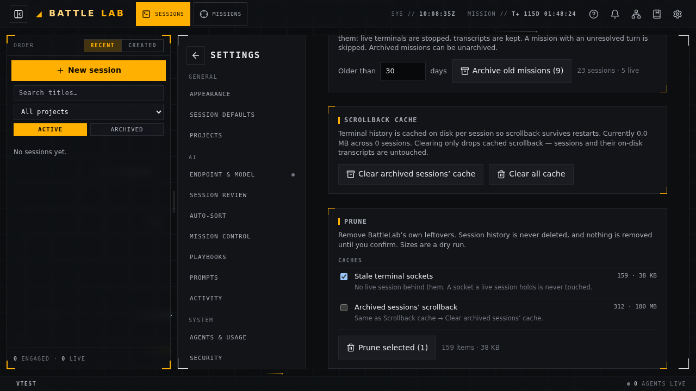
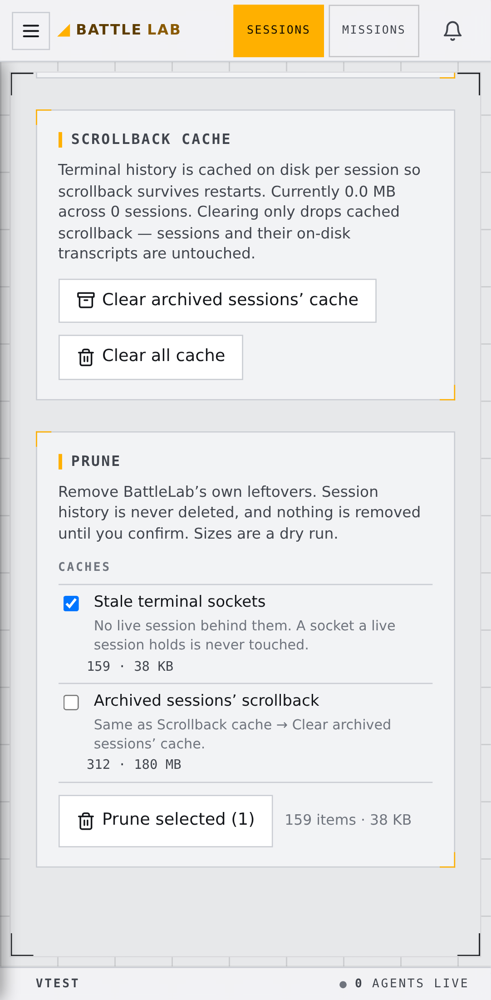
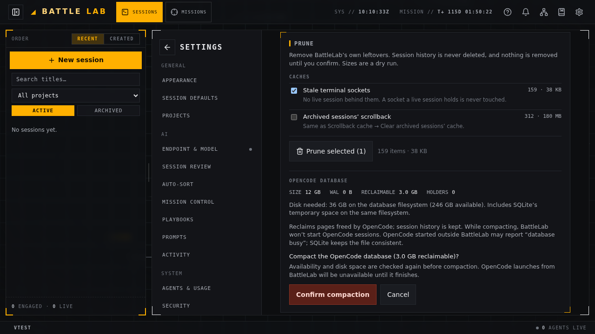
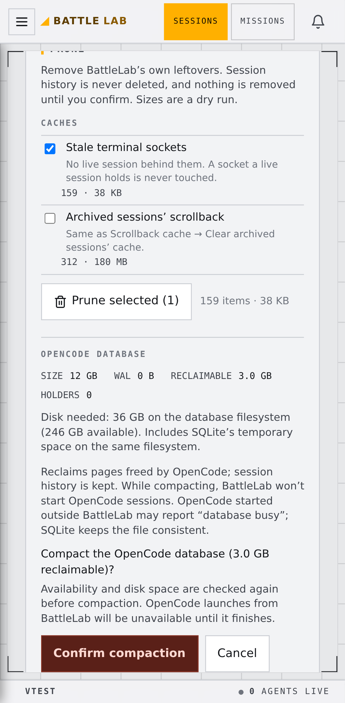

# Maintenance compaction — browser review (#1040)

Real Chromium desktop / Pixel 7 captures with deterministic API fixtures. Before uses increment 1
at `25d730c` (merged in `179ed99`); after uses this PR. No production maintenance was performed.
Forgejo attachment uploads returned nginx 403, so these review artifacts live beside the mockups.

| | Desktop dark | Phone light |
|---|---|---|
| Before |  |  |
| Confirmation |  |  |

[Committed VACUUM with deferred checkpoint](done-mobile-dark.png) · [Every blocker on phone](blockers-mobile.png)

The checked-in `web/e2e/settings-maintenance.spec.ts` exercises confirmation, polling, separate
checkpoint outcomes, all blockers, refresh recovery and 44 px action heights on both viewports.
Capture after a web build with `E2E_PORT=<unused-port> npx playwright test e2e/settings-maintenance.spec.ts
--workers=2`; screenshots are written under `web/test-results`.
